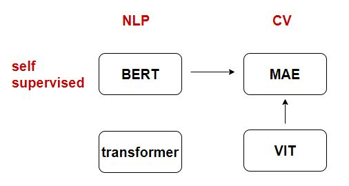
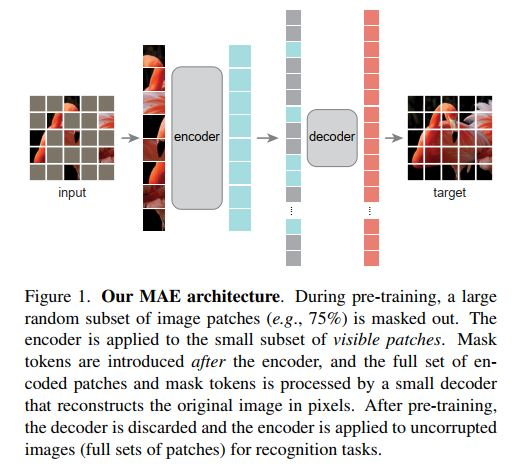

# MAE解读

## 几篇论文梳理

- transformer:基于注意力方法，包含编码器和解码器，机器翻译任务上性能比rnn好
- BERT:使用transformer的编码器，将任务拓展到跟一般的nlp上，采用完型填空的方式，自监督的方法是的不需要对文本进行标注，而是去预测句子里那些词masked不见了，从而获取对文本特征抽取的能力，就可以极大的拓广transformer应用，可以再没有标注的文本上无监督的训练
- ViT就是把transformer用到CV上面，把图分成$16 \times 16$patch，然后做成一个token，当训练集足够大，上亿的时候，ViT的性能要优于CNN
- MAE是在ViT的基础上，把训练拓展到没有标注的数据上，跟BERT一样，通过完型填空来做图像理解

## MAE

Masked  Autoencoders Are Scalable Vision Learners  掩码的自编码器是一个可拓展的视觉学习器

论文题目常见词：efficient ：效果好   ； scalable：模型大，可拓展

masked来自BERT，挖掉一部分东西，autoencoders x和y来自于同一个东西（auto）,CV种encoder的x通常是像素，y是些文本的东西。

**MAE（masked autoencoders）是视觉的一个自学习学习器， 随机的mask输入图像的patch，然后重构消失的部分像素**。两个核心设计：（1）非对称的encoder-decoder结构，encoder只作用在可见的块，节省时间 （2）很大部分的遮挡，75%会产生一个很有意义的自监督学习，如果盖住的比较少插值就可以解决。这两个设计的好处是：**accelerate training(by 3X or  more ) and improve accuracy**，在ViT-Huge上只是使用ImageNet-1K就可以达到87.8%最好的效果(在ViT中相同效果需要300M)

MAE模型架构，图像切块，然后mask掉一些patch，没有被mask掉的进行encoder，盖住的encoder就是灰色，和没有mask的块放到一起，经过decoder。主要的计算量是在encoder，对cv比较重要的任务是对图像编码，编码器只处理没有mask的部分。如果做自己的任务，只需要使用encoder，不需要做mask，对图像切割patch，输入到encoder就可以得到图像的特征了。

## MAE效果

- 在ImageNet上mae重构的而图片，mask部分很多，但基本能灰度原貌

- 在coco验证集上也做相同的重构工作

- 不同的mask比例后重构的效果

## Discussion and conclusion

简单的算法和很好的可扩展性是深度学习的是一个核心内容。在NLP中，自监督方法创造了这种比较好的扩展性，在cv中有监督方法仍然是一个主流。在MAE的工作中，发现自监督方法也能是的CV得到NLP中类似的收益，有一定的可扩展性。很重要的事，**语言和图像本质上是不同的信号，所以将图像分割成patch来作为词token的时候是没有办法考虑语音信息的，但MAE重构的是像素而不是语义主体**。

**Broader impacts**: (1) 从一些带有biases training data 中统计的结果会导致nagative societal impacts (2) 图片会生成不存在的内容

## What makes masked autoencoding different between vision and language?

（1）结构上的不同。在视觉上，CNN仍然是一个主流，这种regular grids就很难把mask tokens 或者positional embedding放到cnn中，但ViT上已经解决了。

mask tokens对图像随机进行遮挡，cnn卷积核的滑动方法就导致无法判断哪些部分是mask，在生成像素的时候就会有问题。

（2）信息密度不同。在language里，一个词就是一个语义和一个信息的主体（一次词解释就会比较长），但在图像里，信息是有高度冗余的，消失的像素和块可以从临近的部分进行插值获得。

masking a very high portion of random patches

（3）autoencoder's decoder 不同。cv中重构的是像素，语义信息很弱，在NLP中预测的词语义信息更高。

在BERT使用MLP就可以预测最后的结果，但在图像重构里往往用的是卷积或者卷积的转置形式。

**MAE做了两件事情：**

- Our MAE masks random patched from the input image and reconstructs the missing patches in the pixel space.

- asymmetric encoder-decoder design.

  非对称encoder-decoder的原因是，很多块被遮住了，所以在decoder时候为了减少时间，就可以适当小一些

**MAE的收益:**

- 训练ViT大模型需要数据量更少

使用ImageNet-1K数据集就可以训练data-hungry models like ViT-Large/Huge(ViT需要训练数据量为这个100倍),就可以达到比较好的精度.

- 在其他任务transfer learning上的泛化性

同时在object detection, instance segmentation, semantic segmentation方向的transfer learning都可以达到好的效果.

- 对其了cv和NLP在自监督学习上的可能 
## MAE方法

MAE是一个简单的自编码方法,通过观测部分的信号来重构原始讯号

- Masking

  random sampling: 跟ViT类似,将图像划分为不重叠的patches,随机sample一个patch子集,然后mask剩下部分.这里需要**random sampling with a  high masking ratio (the  ratio of removed patches)消除冗余**

- MAE  encoder

  encoder是一个只考虑可见/unmasked patches的ViT,由线性映射和positional embedding 构成输入给transformer blocks.

- MAE decoder:需要解码图像的所有,所以需要看到盖住和没盖住的块

  decoder的输入就是全量的tokens,包括两个部分:(1)encoded visible patches (2) mask  tokens.

  每一个mask token 是一个shared, learned vector, 用于表示missing patches prediction.所有的token(包括mask)都需要加上位置信息positional embeddings.

  **MAE decoder只是在预训练过程中需要,被用于图像的重构任务,在图像识别中,只需要encoder去产生图像表征**.

- Reconstruction target

  解码器最后一层就是一个线性层,直接reshape成原图尺度,**loss使用MSE,并且只作用在masked  patches上**,跟BERT一样,看到的部分就不计算损失了

- Simple implementation

  shuffle-unshuffle方法简化操作，encoding 时候random shuffle tokens list，然后去掉后面的部分（remove the last portion of the list）

  unshuffle this full list (inverting the random shuffle operation) to align all tokens with their targets

## 实验

- 主要的实验结果

ft: fineture所有权重，lin： 只调整linear prob

（a）decoder depth: number of  Transformer  blocks

（b）decoder width: number  of channels   （token可以表示为一个多长的向量）

（c）在encoder里面不加入mask token的结果在精度和速度上都是比较好的

**A important design of our MAE is to skip the mask  token [M] in the encoder and apply it  later in the lightweight decoder.**

（d）重构发现像素恢复效果不错

（e）mae对数据增强不敏感

（f）随机采样效果即可

- 采样率实验

- time

  

- mask sampling strategies

  

  **Simple random sampling works the best for our MAE. It allows for a higher masking ratio, which provides a greater
  speed up benefit while also enjoying good accuracy**  

- training schedule

  

**accuracy improves steadily with longer  training** 甚至在1600 epochs时仍然没有看到性能饱和

