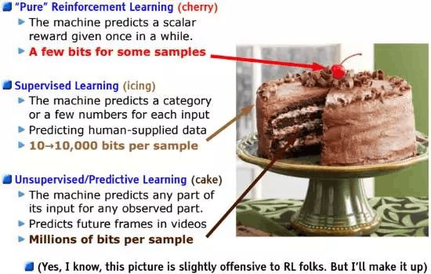
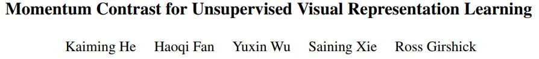
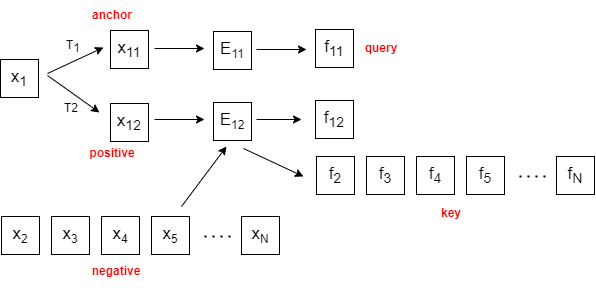
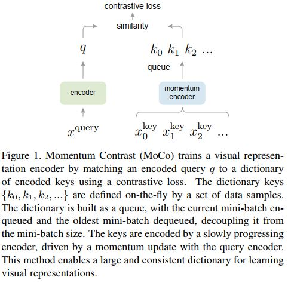

# MoCo解读

**对比学习里程碑式的工作**，作为无监督的工作，性能逼近有监督的基线

**Yann LeCun的“机器学习蛋糕”**：杨立昆（Yann LeCun)有一个关于机器学习三种类型的精彩演讲。他认为，**机器学习就像一个蛋糕，上面点缀的浆果就是强化学习，非常美味，但是数量很少。**有点类似于你赢得或输掉了一个游戏，会有很强的体验感，但并不是经常发生。**然后，蛋糕上的糖霜可以看做是监督学习。**比如，在游戏中得分或死亡，这要比直接输掉或赢得游戏更常发生。**最后就是蛋糕本身了，我们称之为无监督学习，这类是最多的。**我们没有关于这些数据的反馈，也没人会为我们解释这些数据。比如，你通过机器学习来识别猫，首先得准备大量猫、狗的图片，但并没有人告诉你哪些是猫、哪些是狗，这就是无监督学习。但即便是在无监督的情况下，有些机器学习系统还是能分辨出猫和狗。毕竟，猫都长得差不多，狗也长得差不多，而且猫和狗看起来不一样。

**很多大模型都是使用无监督学习得到的**

## 什么是对比学习？

**contrastive learning：对比学习**的目的是**让模型学习哪些样本是相似的，哪些样本是不相似的**。模型不需要知道样本所属的类别，只需要知道样本之间是否相似就可以了。也就是说，假如现在有三张图 $x_1, x_2, x_3$，其中 $x_1, x_2$相似， $x_3$ 与  $x_1, x_2$不相似，三张图片在经过编码器编码后得到三个特征 $f_1, f_2. f_3$，此时模型就需要让 $f_1, f_2$尽量接近，而让 $f_3$与 $f_1, f_2$ 尽量远离。但没有标签信息，又如何知道样本之间是否相似进而提供监督信号去训练模型呢？这一般是通过使用**代理任务 (pretext task)**，人为的定义一些规则，用于定义哪些图片是相似的，哪些图片是不相似的来完成的。代理任务多种多样，例如在**个体判别 (instance discrimination)**中，我们从数据集中随机选取一张图片 $x_i$，对该图片做随机裁剪并进行数据增强 (color jittering、horizontal flip,、grayscale conversion) 得到 $x_i^1, x_i^2$，由于它们都是从同一张图片得到的，语义信息应该相近，因此可以将 $x_i^1$ 和$x_i^2$ 视为相似的正样本，数据集中的所有其他样本都是不相似的负样本，这就相当于将数据集中的每一个样本都看作一个单独的类别。在得到正样本和负样本之后，流程就基本固定了，就是利用 **对比损失 (contrastive loss)** 函数使得相似样本的特征尽量接近，不相似样本的特征尽量远离。

## MoCo

 

用动量对比的方法用于无监督表征学习。这里的对比就指的对比学习，动量用数学表达为$y_t = m\cdot y_{t-1} + (1-m)\cdot x_t$，其中$m$是超参数，$y_{t-1}$为上一时刻的输出，$y_t$为当前时刻的输出，$x_t$为当前时刻的输入。当前时刻的输出不仅依靠当前时刻的输入，还要依赖前一时刻的输出。

## dictionary look-up

- 无监督表征学习（unsupervised representation learning）在NLP中取得了成功，如GPT， BERT，但在CV中主流的方法仍然还是有监督学习。原因是文字和图像属于不同的信号空间，语言任务是一个离散的信号空间，由词和词根单元组成（word， sub-word units）tokenized dictionaries，这个也是无监督学习的根本。但在cv中，原始图像是连续的，高维空间，很难做结构化的处理。

contrastive loss是一种可以用于视觉表征的无监督学习方法，这种方法可以被看成是building dynamic dictionaries。

图像$x_1$经过变换生成anchor和positive instance，由encoder(可以相同也可以不同)生成特征$f_{11}, f_{12}$，$f_{11}$作为query。负样本经过encoder生成不同的特征作为key。所以自监督学习训练encoders去做一个字典查询（perform dictionary look-up）：query应该跟其匹配的key更加相似，跟不匹配的keys不相似。最终就转化为一个最小化对比损失的学习。

- 创建字典的两个要求

  - large

    保证搜索空间足够，防止学习到short-cut solution

  - 一致性consistent

    keys应该使用相同或者相似的encoders得到

## why MoCo?

**MoCo（momentum contrast）给出了在对比学习（无监督学习）中创建large and  consistent dictionaries的方法。**

