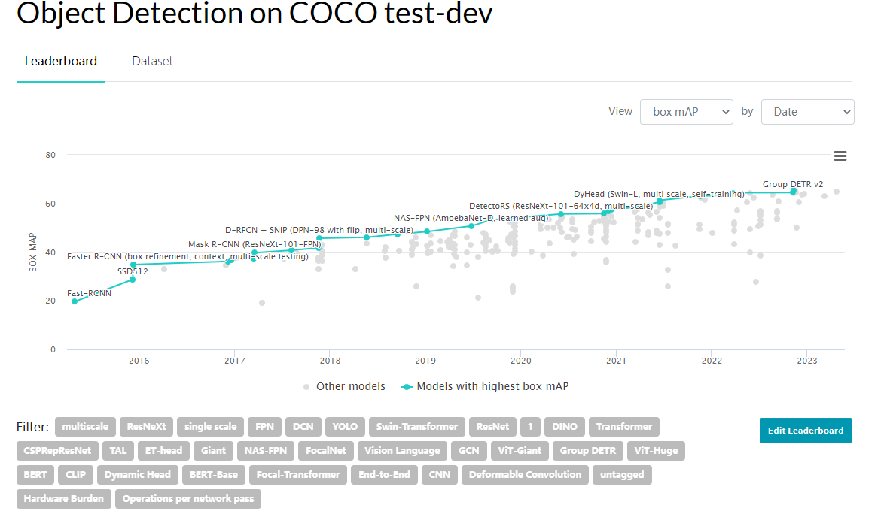

# Vision Transformer(ViT)

### Vision Transform挑战了2012（alexNet）以来cnn在视觉方面的统治地位，有足够的数据前提下，预训练的模型即使没有cnn，在视觉上也能达到很好的效果。ViT打破了cv和nlp之间的壁垒，在多模态领域有一个新的开启。

## ViT优异表现

transformer确实在CV上的表现优秀，paperWithCode网站公布了论文的排名情况：

图像分类：

排名靠前的都是基于ViT的方法。

目标检测

好的结果也都是基于swim transformer，iccv2021最佳论文。

ViT除了在CV上有很好的表现外，相对CNN还有很多的特性。

《Intriguing properties of vision transformer》中指出ViT一些有趣的特性，在一些任务上CNN无法处理，但ViT可以处理的很好

## ViT(Vision Transformer)

ViT(Vision Transformer)，最经典的一篇文章，2021 Google Research和BrainTeam的

一张图片可以等价位16$\times$16的单词，图像可以看作patch组成，每个patch大小16$\times$16，transformer用于大规模图像识别

## 为什么在CV上用transformer

transformer在自然语言处理方面已成一个标准的模块，但在视觉方面的应用还是受限。在视觉方面，attention通常是跟卷积网络混合使用或者用于替卷积的某些部分但保持整体结构不变。但其实CNN不是必须的，一个纯transformer结构可以直接从序列化的图像patch上获得比较好的表现。尤其当在大数据集上预训练然后在中小型数据集（ImageNet, CIFAR-100， VTAB）上微调时，ViT可以达到很好的效果，并且训练只需要比较少的计算资源。（这里的计算资源是相对于2500天TPUv3这样的更耗卡的模型而言，小了不少，但其实计算量也还是很大的——先定一个小目标，挣一个亿~）

**文章的一个主要贡献就是证明了，只是用transformer（ViT），不再有cnn在大规模data上预训练，中小型data微调也可以SOAT，并且ViT需要的资源更少**

self-attention base的结构，尤其是Transformer在NLP中已经成为一个模型的必选结构。主流的方法在大规模数据上预训练，在小的数据集上微调达到更好的效果，**并且随着数据集的增加，still no sign of saturating performace（性能饱和）。在CNN上性能不会一直提升，在transformer上这种观测不到性能饱和，是一个很重要的特性**。

在NLP中，对词向量使用transformer，向decoder输入单词，输出一些元素，其中使用到attention，输出自注意力图。平移到图像上，一种直观的想法是，把每一个像素作为输入，套用transformer，但这样显然是不合理的。$224\times224$的图像，输入就是50176个向量，显然这个输入维度是很高的，不太能接受，这还是一个分类任务，对分割、检测等任务，使用的图像分辨率就更大，复杂度就更高了。所以，**需要将图分块，transformer的输入是这些图像块的linear embeddings序列，这时图像patch就可以看成是NLP中的tokens（words）。在这个时候训练的ViT分类还是有监督的。**

当在一个中等的数据集上（ImageNet）上训练 without strong regularization时，ViT效果要比同等大小的ResNet差，这个结果也是可以预料到的。原因是：Transformer相比于CNN缺少归纳偏置（inductive biases）,**CNN有两个很重要的归纳偏置：平移不变性（translation equivariance）和块间位置关系**（locality），这两个biases就导致了即使在训练数据量充足的时候，CNN也能有较好的泛化性。

- translation equivariance
  $$
  CNN(T(x)) = T(CNN(x))
  $$
  
- locality，卷积核滑动计算(eg. kernel_size = 3, stride=1, 重叠)cell值，可以体现块之间的关系

**transformer为了弥补inductive biases上的不足，需要在大规模数据集上pretrain，小数据集上finetune**

## Method

standard transformer的输入是一维的token embeddings序列，对2D图像 $x_p\in R^{H\times W \times C}$ 分割成固定到小为$P \times P$的patch，可以得到$N = \frac{HW}{P^2}$  个patch， 所以二维图像变成flattened sequence $x_p\in R^{N\times (P^{2} \cdot C)}$ ，transformer使用了一个latent vector size $D$ ，所以对patch，先flatten成向量，然后trainable线性映射到D维向量上，这个向量就是patch embedding

对于一个分类任务，希望是通过patch embeddings的输入，有transformer得到类别输出，**所以引入一个[class] token**，是一个learnable embedding $z_0^0=x_{class}$，经过transformer以后都会得到class token对应的输出$z_L^0$，对应于标签$y$。ViT在大规模数据集上pretrain和中小数据集上finetune，对于网络而言，在于最后输出的类别数有差别，所以最后的clas head需要修改，class head在pretrain的时候是一个隐藏层接MLP，在finetune的时候用的是一个线性层。

在图像里面也需要考虑到位置信息（spatial information），所以把position embedding加到patch embeddings上获取位置信息。ViT中用的是standard learnable 1D position embeddings，实验也证明了2D-aware position embeddings没有获得很大的增益。

Transformer encoder包含mutilheaded self-attention(MSA) block和MLP block。在每一个block之前都是用Layernorm(LN)，在每一个block后使用residual connections。MLP包含two layers with a GELU non-linearity。

**we pre-train ViT on large datasets, and fine-tune to (smaller) downstream tasks。**在预训练中使用的**head和微调不匹配（输出类别数）**，zero-initialied $D \times K$ layer，$K$是下游任务的classes number。某些情况下，**finetune更高分辨率数据**效果更好，但仍然保证patch size 不变，输入的sequence 长度变大，VIT可以处理任意长度的序列输入问题，但这个时候position embedding可能没有效果，有一个做法是对pretrained position embedding进行2D interpolation，找到在不同分辨率图像的对应关系。

## 实验结论

- 在不同数据上训练对比

  | ImageNet     | 1k classes, 1.3M images                  |
  | ------------ | ---------------------------------------- |
  | ImageNet-21k | 21k classes, 14M images                  |
  | JFT          | 18k classes, 303M high-resolution images |
  
  transfer models on: ImageNet original validation labels and clean-up Real labels, CIFAR-10/100，Oxford-IIIT Pets, Oxford Flowers-102.

  

对ViT-L/16模型，在ImageNet-21k预训练，在其他的数据集上表现也不错，然而使用的预训练资源是比较少的，TPUv3 8核接近30天。

- 数据要求实验（data requirements）**最重要的实验**

(1) 在大的数据集（JFT-300M）上预训练后效果更好（ViT到底需要多少数据才能训练好）

图3，阴影区域是不同大小BiT(ResNet50-ResNet152)在不同数据集上的性能，所有的模型都在横轴的数据集上训练，然后在ImageNet上fine-tune（ImageNet预训练模型也需要在ImageNet上finetune，因为resolution 增加会提高performance）。从图上可以看出来，**在中小型数据量ImageNet和ImageNet21K上，ViT的performance是不如CNN-base方法的，但数据量增大，VIT的性能就显现出来了**，这个表现跟ViT没有先验知识有关

图4，用ViT做特征提取器，在不同的数据量上做5-shot evaluation，结论也是类似的，预训练数据集小的时候，效果比较差，需要大数据集、

（2）同等计算量，比较不同的模型

同等计算量，ViT要比resNet好，再计算量比较小的时候，混合模型精度很高，随着模型越来越大的时候，很合模型基本跟transformer相似，增大以后混合模型性能饱和，但transformer没有出现饱和。

- 模型可视化

  

  （1）first layer embedding E，跟卷积学习结果比较小，类似于gabor filter——RGB embedding filters，颜色，纹理

  （2）position embedding ，相似1，不相似-1，从图上看可以学到位置信息，中间位置黄，向四周颜色变蓝。同时可以看到同行同列黄色性更高，说明也可以学到2D信息。也说明为什么换成2d没有提升，1d可以解决问题

  （3）ViT在开始层确实能观测到像素的距离，在后面的层就能看到语义信息（自注意力是不是能模拟长距离关系）

  

  